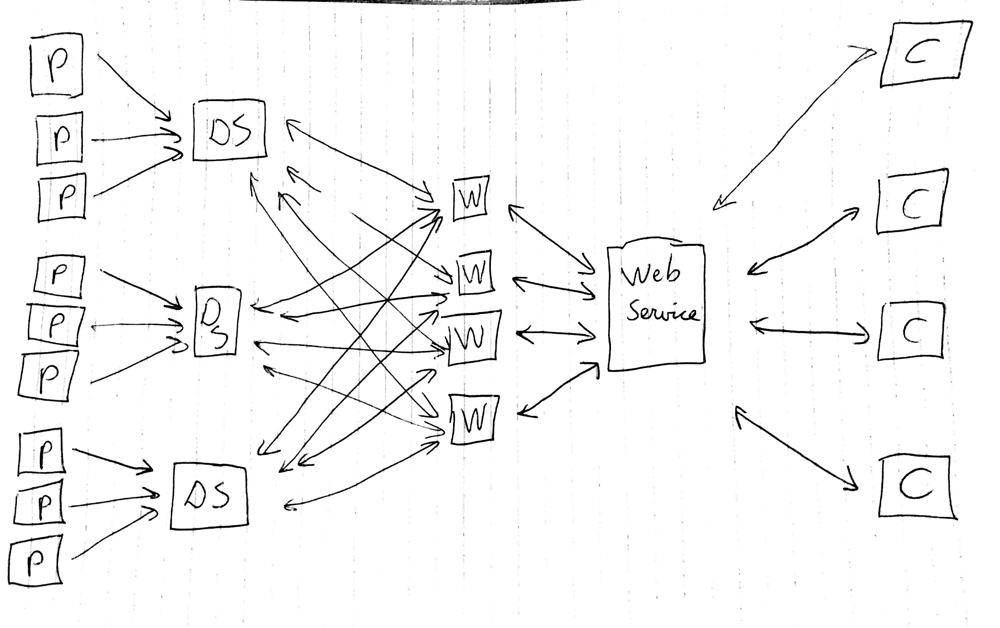

## Structure of the application
The following techniques are used:

* Players send data over UDP sockets to a data server
* Coaches can request information / heatmaps using a webservice
* Webservices request data from the data server using a queue.

## Entity descriptions
### Player
Android application sending location data to the data server.

### Data server
Server that handles incoming data packets and store them in an organized manner.

### Web service
The web service receives requests from the coaches for data like heatmaps and statistics. The web service replies with a structured reply, containing this data or any error messages.

### Coaches 
Coaches request data from the web service, based on user input. The coach entity can display this information. The coach entity is a web-based platform.

## Inter-entity communication
### Player - Data server
Players send the following data to the data server, using UDP sockets:

* player_id
* match_id
* location
* datetime

### Coach - Web service
The coach sends requests to the web service for generating stuff. This is done using a REST api and is done based on user input.

### Web Service - Data Servers
The web servers uses a RabbitMQ to request the data request from coaches. Say, a coach want to make a heatmap of player x in match y, the web servers puts a request in the queue with "give me all locations of player x in match y". All Data Servers read this and respond with the data.

### Player - Web Service
The player can request match data from the web service.
