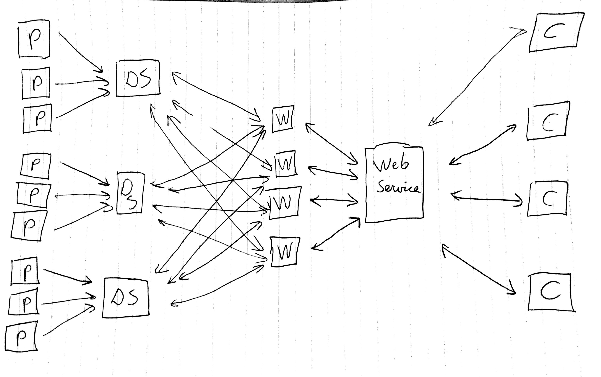

## Structure of the application
The following techniques are used:

* Players send data over UDP sockets to a data server
* Coaches can request information / heatmaps using a webservice
* Webservices request data from the data server. On request, the data server launches workers who do the actual work (i.e. generating heatmaps, calculating statistics, etc)

## Entity descriptions
### Player
Android application sending location data to the data server.

### Data server
Server that handles incoming data packets and store them in an organized manner.

### Web service
The web service receives requests from the coaches for data like heatmaps and statistics. The web service replies with a structured reply, containing this data or any error messages.

### Coaches 
Coaches request data from the web service, based on user input. The coach entity can display this information. The coach entity is a web-based platform.

### Workers
Workers are activated by the webservice and generate the heatmaps / statistics. They communicate with the data server to get the data and return the result back to the webservice.

## Inter-entity communication
### Player - Data server
Players send the following data to the data server, using UDP sockets:

* player_id
* location
* datetime

They send this data with a frequency of .. packets per ..

### Coach - Web service
The coach sends requests to the web service for generating stuff. This is done using a REST api and is done based on user input.

### Web Service - Workers
Web service send the requirements for the requested object to a worker queue using RabbitMQ. Workers pick this up and do the task, by gathering data from the data server. When done, the worker notifies the web service that the task has been completed.

### Workers - Data server
The workers request data from the data server for the object they want to generate.

